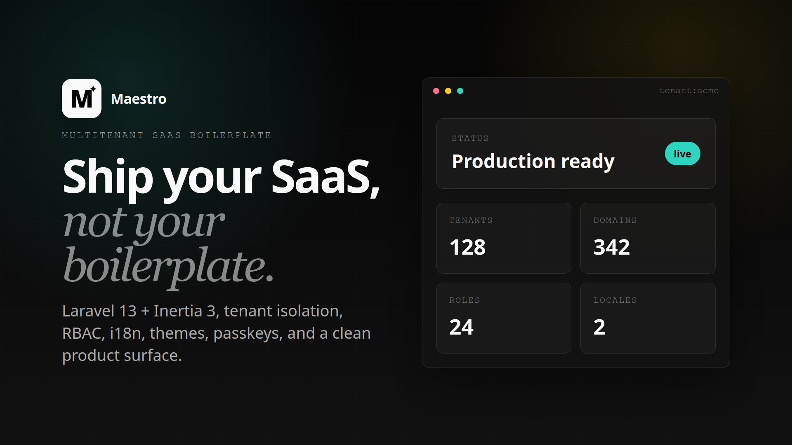

# Maestro

Laravel starter kit for building a multi-tenant SaaS. Maestro separates the central application from each customer organization: the central app manages tenants and domains, while every tenant runs with its own database and isolated resources.



## Features

- Domain-based multi-tenancy with [stancl/tenancy](https://tenancyforlaravel.com/).
- One database per tenant, created, migrated, and seeded when an organization is created.
- Tenant-scoped cache, queues, sessions, storage, and permissions.
- Central dashboard for managing tenants, domains, and tenant announcements.
- Tenant dashboard with users, roles, permissions, and a notification inbox.
- Laravel Fortify authentication: registration, password reset, email verification, 2FA, and passkeys.
- Laravel Cashier + Stripe subscriptions with Checkout, the Billing Portal, invoice downloads, and webhook-driven subscription sync.
- Ready-to-use SaaS plans with editable prices and per-plan limits for workspaces, domains, tenant users, and custom roles.
- React 19 + Inertia 3 + TypeScript + Tailwind CSS 4 frontend.
- Typed routes generated by Laravel Wayfinder, English and Spanish localization, and Pusher/Echo broadcasting.

## Tenancy architecture

```text
maestro.test                     Central application
├── /manage/tenants              Create and manage organizations
└── /manage/domains              Manage domains

acme.maestro.test                Tenant application
├── Domain-based identification
├── Database: tnt_<tenant-id>_db
├── Tenant-scoped storage, session, and cache
└── Its own users, roles, and permissions
```

Universal routes are loaded in both contexts. When a tenant domain is resolved, `InitializeTenancyByDomain` initializes the context and switches authentication to that tenant's users. The permissions bootstrapper also changes Spatie Permission's cache key, preventing roles and permissions from leaking between organizations.

## Requirements

- PHP 8.3 or later
- Composer
- Node.js 22 or later and pnpm
- SQLite for quick local development, or MySQL/MariaDB/PostgreSQL for a production-like setup

> With the database-per-tenant model, the database server must be allowed to create databases. SQLite works well for local development.

## Getting started

1. Install dependencies and prepare the environment:

   ```bash
   composer install
   pnpm install
   cp .env.example .env
   php artisan key:generate
   ```

2. Configure the central application in `.env`. For local SQLite development:

   ```dotenv
   APP_URL=http://maestro.test
   DB_CONNECTION=sqlite
   ```

   Create the SQLite file if it does not exist:

   ```bash
   touch database/database.sqlite
   ```

3. Migrate and seed the central database:

   ```bash
   php artisan migrate --seed
   ```

   The seeder creates the central root user with the `MAESTRO_DEFAULT_SUPERUSER*` values from `.env`.

4. Generate typed routes and start the development processes:

   ```bash
   php artisan wayfinder:generate
   composer run dev
   ```

   You can also run each process independently with `php artisan serve`, `php artisan queue:listen`, and `pnpm dev`.

5. Open the URL defined by `APP_URL`, sign in as the root user, and create a tenant from **Manage tenants**. On creation, the application:

   1. Generates a ULID and a unique slug.
   2. Registers an automatic domain in the `<slug>.<central-domain>` format.
   3. Creates its database, runs the migrations in `database/migrations/tenant`, and seeds its initial users, roles, and permissions.
   4. Sets up its storage links.

To access a tenant locally, make sure its subdomain resolves on your machine. For example, use a local DNS service or a hosts-file entry:

```text
127.0.0.1 maestro.test acme.maestro.test
```

## Billing, plans, and limits

Maestro uses Laravel Cashier (Stripe) for recurring subscriptions. Customers start subscriptions through Stripe Checkout and can manage payment methods, invoices, cancellations, and plan changes in the Stripe Billing Portal. Cashier keeps the local subscription records synchronized from Stripe webhooks.

The central **Manage plans** area includes three prebuilt plans ready for a more complete SaaS offering:

| Plan | Monthly | Yearly | Included limits |
| --- | ---: | ---: | --- |
| Starter | $19 | $190 | 1 workspace, 1 default domain, 1 custom domain, 5 tenant users, 3 custom roles |
| Growth | $49 | $490 | 3 workspaces, 3 default domains, 3 custom domains, 25 tenant users, 10 custom roles |
| Scale | $99 | $990 | 10 workspaces, 10 default domains, 10 custom domains, 100 tenant users, 50 custom roles |

All values are seeded as draft Stripe prices in USD and can be customized from the plan management screen before publication. Each plan has independently configurable limits for:

- Workspaces (tenants)
- Default and custom domains
- Tenant users
- Tenant custom roles

Publishing a plan or price creates or updates its Stripe catalog entry. Price changes are published as new Stripe prices; existing subscriptions are migrated at their next renewal where applicable. Billing access is enforced hourly: inactive subscriptions move workspaces to read-only access and, after the grace period, to suspended access.

### Stripe configuration for development

1. Add Stripe test credentials to `.env`:

   ```dotenv
   STRIPE_KEY=pk_test_...
   STRIPE_SECRET=sk_test_...
   CASHIER_CURRENCY=usd
   CASHIER_CURRENCY_LOCALE=en_US
   ```

2. Sign in to the Stripe CLI and forward Stripe events to Cashier's default webhook route. Use a locally trusted HTTPS domain when forwarding to `https://maestro.test`:

   ```bash
   stripe login
   stripe listen --forward-to https://maestro.test/stripe/webhook
   ```

   Copy the `whsec_...` signing secret printed by the CLI into `.env`:

   ```dotenv
   STRIPE_WEBHOOK_SECRET=whsec_...
   ```

3. Seed or publish the catalog after the test keys are configured:

   ```bash
   php artisan db:seed --class=PlanSeeder
   php artisan billing:sync-catalog
   ```

   The webhook listener must remain running while testing Checkout, subscription changes, or the Billing Portal. A successful Checkout redirect does not by itself confirm a subscription; the webhook updates Cashier's local records.

### Stripe configuration for production

1. Set the production URL and live Stripe credentials in the deployment environment. Do not commit these values:

   ```dotenv
   APP_URL=https://app.example.com
   STRIPE_KEY=pk_live_...
   STRIPE_SECRET=sk_live_...
   STRIPE_WEBHOOK_SECRET=whsec_...
   CASHIER_CURRENCY=usd
   CASHIER_CURRENCY_LOCALE=en_US
   ```

2. Create a Stripe webhook for `https://app.example.com/stripe/webhook`. You can create it from the Stripe Dashboard or let Cashier create it using the configured `APP_URL`:

   ```bash
   php artisan cashier:webhook
   ```

   Enable at least these events: `customer.subscription.created`, `customer.subscription.updated`, `customer.subscription.deleted`, `customer.updated`, `customer.deleted`, `payment_method.automatically_updated`, `invoice.payment_action_required`, and `invoice.payment_succeeded`.

3. Copy the webhook signing secret from Stripe into `STRIPE_WEBHOOK_SECRET`, deploy the configuration, and ensure the webhook endpoint is publicly reachable over HTTPS. Cashier verifies incoming webhook signatures with this secret.

4. Run a queue worker and the Laravel scheduler in production. The scheduler runs billing-access enforcement hourly, while queued jobs process scheduled subscription price migrations and notifications:

   ```bash
   php artisan queue:work
   php artisan schedule:work
   ```

5. Publish any draft plan prices after confirming the live credentials and webhook configuration:

   ```bash
   php artisan billing:sync-catalog
   ```

> Keep `stripe/*` excluded from CSRF protection. This application already uses Cashier's default `/stripe/webhook` endpoint and signature verification.

## Contexts and routes

| Context | Domain | Responsibility |
| --- | --- | --- |
| Central | `APP_URL` | Manage tenants, domains, and global announcements. |
| Universal | Central and tenant | Home, authentication, profile, security, dashboard, users, roles, permissions, and notifications. |
| Tenant | Assigned tenant domain | Add organization-specific features in `routes/tenant`. |

Central routes live in `routes/central`, universal routes in `routes/universal`, and tenant-specific routes in `routes/tenant`. Keep central migrations in `database/migrations`; add tenant migrations to `database/migrations/tenant`.

## Customization

- **Tenant data:** extend `App\\Models\\Central\\Tenant` and its central migration.
- **Provisioning:** add jobs to the `TenantCreated` pipeline in `app/Providers/TenancyServiceProvider.php`.
- **Organization-specific features:** add routes in `routes/tenant/web.php`, migrations in `database/migrations/tenant`, and pages in `resources/js/pages/tenant`.
- **Shared features:** use `routes/universal` and `resources/js/pages/universal`.
- **Default permissions:** update `database/seeders/DatabaseSeeder.php` for the central app and `database/seeders/Tenant/DatabaseSeeder.php` for each tenant.
- **Custom domains:** use the central domain dashboard; tenant identification is always domain-based.

## Useful commands

```bash
# List registered tenants
php artisan tenants:list

# Migrate or seed all tenants
php artisan tenants:migrate
php artisan tenants:seed

# Run a command for one or more tenants
php artisan tenants:run "cache:clear"

# Create or remove public links for tenant storage
php artisan tenants:link

# Check code quality and run tests
pnpm run lint:check
pnpm run types:check
php artisan test --compact
```

## Testing

The test suite uses Pest. It covers tenant creation and slugs, authentication, security, the dashboard, and notifications across central and tenant contexts.

```bash
php artisan test --compact
php artisan test --compact tests/Feature/TenantCreationSlugTest.php
```

## Relevant structure

```text
app/
├── Models/Central/          Central application models
├── Models/Tenant/           Organization-isolated models
├── Providers/TenancyServiceProvider.php
└── Bootstrappers/           Tenant-initialized integrations
database/
├── migrations/              Central schema
├── migrations/tenant/       Schema for each organization
└── seeders/Tenant/          Initial data for each organization
resources/js/
├── pages/central/           Central administration dashboard
├── pages/tenant/            Tenant-only screens
└── pages/universal/         Shared screens
routes/
├── central/
├── tenant/
└── universal/
```

## ❤️ Support my work

If my open-source projects have helped you, you can support their continued development through:

- [GitHub Sponsors](https://github.com/sponsors/danidoble)
- [Support me via Stripe](https://donate.stripe.com/7sYdR85X7cgmcnd8Ep7bW01)

Your support helps fund development, infrastructure, hardware testing, documentation, and new open-source projects.
